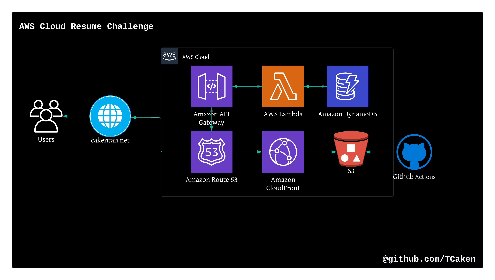

# AWS Cloud Resume Challenge

This is my attempt at cloud resume challenge in AWS.
What is Cloud Resume Challenge? - [The Cloud Resume Challenge](https://cloudresumechallenge.dev/) is a multiple-step resume project which helps build and demonstrate skills fundamental to pursuing a career in Cloud. The project was published by Forrest Brazeal.

You can access my cloud resume [here](cakentan.net)

## Architecture

**Services Used**:

- S3 (Static Website Hosting)
- AWS CloudFront
- Certificate Manager
- AWS Lambda
- DynamoDB
- GitHub Actions
- Terraform
